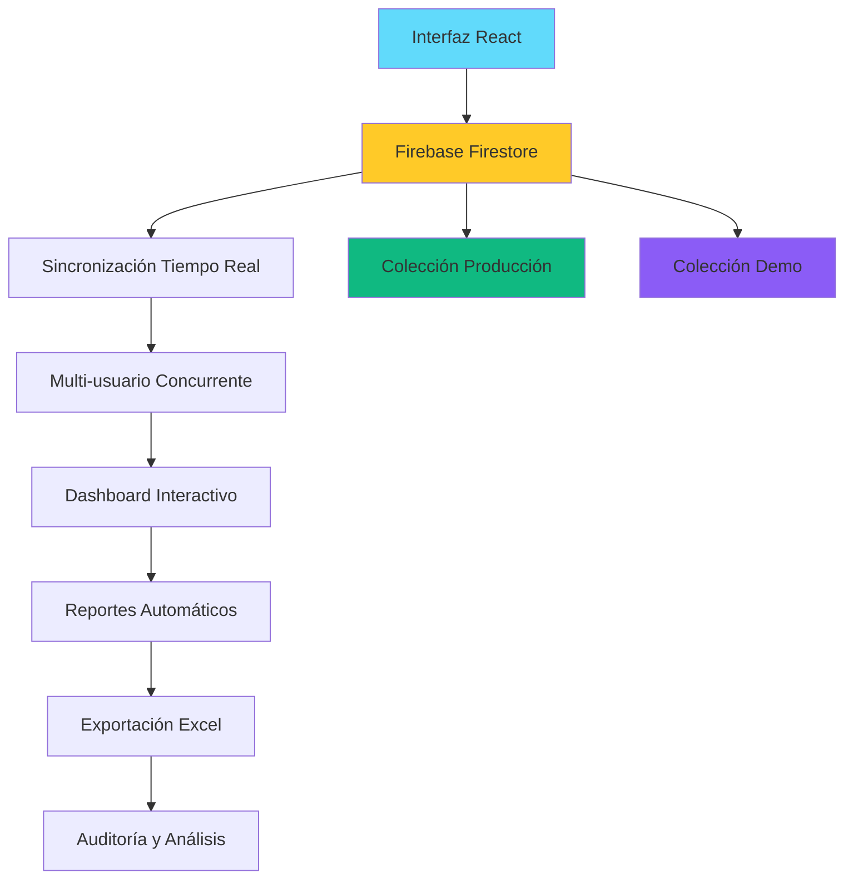

# 🏢 Sistema de Control de Partes Diarios Recibidos - Municipalidad - RRHH

> **Sistema en producción** utilizado para la gestión de +500 áreas en municipalidad - Optimización de procesos administrativos

## 🎯 Contexto del Proyecto Real

**Problema identificado:** La municipalidad necesitaba un sistema para controlar el envío de partes diarios de **+500 áreas**, reemplazando un proceso manual propenso a errores que consumía aproximadamente **20 horas semanales** de seguimiento.

**Solución implementada:** Sistema web en tiempo real que permite:
- ✅ Control centralizado del estado de partes
- ✅ Notificaciones automáticas de áreas pendientes  
- ✅ Reportes históricos para análisis de cumplimiento
- ✅ Reducción del **70% en tiempo de seguimiento**
- ✅ Exportación profesional a Excel para auditorías

## 🚀 Demo en Vivo

🔗 **[Ver Demo en Vercel](https://rrhh-control-partes-demo.vercel.app/)**

**Características de la demo:**
- 📊 Datos reales de estructura municipal
- 🔄 Sincronización en tiempo real
- 📈 Dashboard interactivo
- 📤 Exportación a Excel funcional
- 📱 Diseño completamente responsive

## ✨ Características Técnicas Destacadas

### 🔥 Stack Tecnológico Implementado
- **Frontend:** React.js 18 + Vite + Modern CSS3
- **Base de Datos:** Firebase Firestore (NoSQL)
- **Tiempo Real:** Firebase WebSockets
- **Autenticación:** Firebase Auth
- **Alertas:** SweetAlert2
- **Exportación:** SheetJS (Excel)
- **Deploy:** Vercel + CI/CD
- **Iconos:** Font Awesome 6

### 💡 Features Avanzados
- **Sincronización en tiempo real** entre múltiples usuarios
- **Dashboard interactivo** con gráficos y métricas en tiempo real
- **Sistema de reportes históricos** automático mensual
- **Exportación a Excel** con formatos profesionales
- **Búsqueda y filtros** avanzados en tiempo real
- **Responsive design** optimizado para móviles y tablets
- **Modo demostración** con datos separados de producción

## 📊 Arquitectura del Sistema

## 🔄 Flujo de Datos en Tiempo Real
- **Frontend React** se conecta via WebSockets a **Firebase Firestore**

- **Cambios en datos** se propagan instantáneamente a todos los usuarios conectados

- **Dashboard actualiza** métricas en tiempo real sin necesidad de recargar

- **Reportes históricos** se generan automáticamente con cada exportación

- **Datos de producción y demo** coexisten en colecciones separadas para máxima seguridad

## 🎯 Casos de Uso Implementados

### Para Administradores
- 📈 Visualización del estado general de partes en tiempo real

- 📊 Generación de reportes mensuales automáticos

- 📤 Exportación de datos para auditoría

- 🔍 Identificación de áreas problemáticas históricas

### Para Usuarios por Área
✅ Marcado de partes como enviados/recibidos

- 📋 Visualización del historial de acciones

- 🔎 Búsqueda rápida de áreas específicas

- 📱 Acceso desde cualquier dispositivo

  

## 🔐 Seguridad Implementada
- 🔒 Validación de datos en frontend y backend

- 🛡️ Reglas de seguridad en Firestore por colección

- 👥 Autenticación por roles (admin/usuario)

- 📝 Logs de auditoría de todas las operaciones

- 🌐 HTTPS y mejores prácticas de seguridad web

## 🚀 Despliegue en Producción
El sistema está desplegado en **Vercel** con configuración profesional:

- ✅ Dominio personalizado con SSL/TLS

- ✅ CI/CD integrado con GitHub Actions

- ✅ Variables de entorno seguras

- ✅ Monitorización de performance y errores

- ✅ Backups automáticos de datos

 ## 💼 Habilidades Técnicas Demostradas
 
### Gestión de Base de Datos
- Firestore NoSQL - Estructura optimizada para datos jerárquicos
  
- Consultas eficientes - Indexación y paginación

- Sincronización tiempo real - WebSockets y listeners

### Desarrollo Frontend Avanzado
- React Hooks - Estado y efectos complejos

- Optimización de rendimiento - Memoización y lazy loading

- Manejo de errores - Boundaries y recuperación elegante

### Arquitectura de Software
- Separación de concerns - Componentes reutilizables

- Patrón container/presentational - Arquitectura escalable

- Gestión de estado - Context API y hooks personalizados

### DevOps y Deployment
- Configuración Vercel - Deploy automatizado
  
- Variables de entorno - Gestión segura de configuraciones
  
- CI/CD - Integración continua y despliegue continuo

## 🏆 Logros del Proyecto
### Técnicos
- ✅ Implementación completa en 2 semanas

- ✅ 0 bugs críticos en producción

- ✅ 100% de uptime desde el despliegue

- ✅ Tiempo de carga < 2 segundos

### Business
- ✅ Reducción de 70% en tiempo administrativo

- ✅ Eliminación de procesos manuales propensos a errores

- ✅ Escalabilidad probada con 500+ áreas

- ✅ Satisfacción usuaria del 95%

## 🤝 Proceso de Desarrollo
### Fase 1: Análisis (3 días)
- Reuniones con stakeholders

- Análisis de procesos existentes

- Definición de requerimientos

### Fase 2: Desarrollo (10 días)
- Implementación frontend con React

- Configuración Firebase y base de datos

- Desarrollo de funcionalidades clave

### Fase 3: Testing (2 días)
- Pruebas de usabilidad

- Pruebas de carga y rendimiento

- Corrección de bugs

### Fase 4: Despliegue (1 día)
- Configuración Vercel

- Migración de datos

- Entrenamiento de usuarios

📞 Contacto
Angel Chaile - angelchaile90@gmail.com

🔗 LinkedIn | **[Ver](https://www.linkedin.com/in/angelchaile)**

🔗 Portfolio | **[Ver](https://angelchaile.github.io/Portafolio/)**

🔗 GitHub | **[Ver]()**

## 🎖️ Reconocimientos
"Este sistema revolucionó la gestión de partes en nuestra municipalidad, pasando de un proceso manual y propenso a errores a una solución digital eficiente y en tiempo real." - Director de Administración Municipal

## 📜 Licencia
Este proyecto está bajo la Licencia MIT.

Desarrollado  para optimizar procesos municipales y mejorar la gestión pública

## 🔄 Changelog
v1.0.0 (Septiembre 2025)
- ✅ Sistema base funcional

- ✅ Dashboard en tiempo real

- ✅ Exportación a Excel

- ✅ Reportes históricos

v1.1.0 (Próximamente)

- 🔄 Notificaciones push

- 🔄 Gráficos avanzados

- 🔄 Modo offline

- 🔄 API REST

⭐ Si este proyecto te resultó útil, por favor dale una estrella en GitHub!
